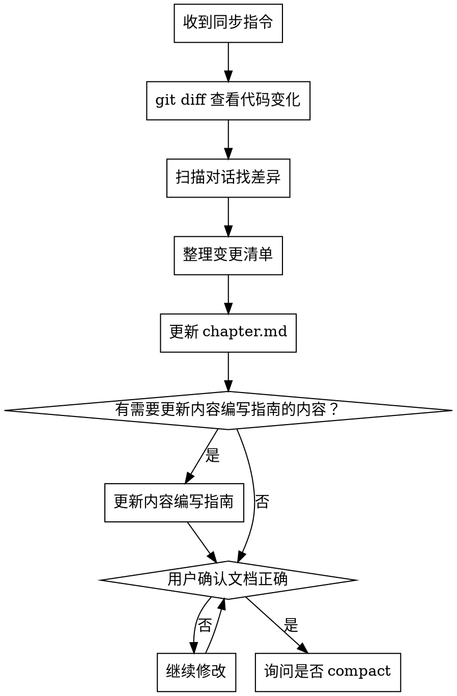

# RTOS 章节文档同步（本项目专用）

## 项目背景

本 skill 专用于 `rust_qemu` RTOS 项目，在完成一章的实践验证后运行，确保文档内容与实际代码一致，然后收尾本章上下文。

## 流程



## 第一步：收集变更

**1a. git diff 查看代码变化**

```bash
git diff HEAD
git status
```

如果尚未初始化 git，改用文件系统扫描：
```bash
find . -name "*.rs" -newer docs/chapters/当前章节/chapter.md
```

**1b. 扫描当前对话**

通读对话记录，找出：
- 文档中的步骤与实际操作不一致的地方
- 验证途中发现的问题和修正方案
- 用户明确说"文档里这里不对" / "应该改成..." 的内容
- 技术选型发生了变化（如换了 QEMU board）

**1c. 整理变更清单**

在回复中列出变更清单，格式：

```
变更清单：
1. [章节名] 步骤 N：原文 "..." → 实际应为 "..."
2. 验证命令：新增参数 -xxx
3. 前置知识：补充工具版本要求 xxx
```

## 第二步：更新 chapter.md

按变更清单逐条修改 `docs/chapters/NN-章节名/chapter.md`：

- 修正不准确的步骤描述
- 更新验证命令（确保命令可以直接复制运行）
- 补充实践中遇到的新坑（可在「验证方法」后追加说明，或在步骤内注明）
- 更新 frontmatter 中变更的字段（如 keywords、difficulty）

## 第三步：确认

列出所有修改点，请用户确认：

> 本章共修改了以下内容：
> 1. ...
> 2. ...
> 是否还有遗漏需要修改？

等用户确认无误后进入第四步。

## 第四步：询问 compact

```
本章文档已同步完成。

当前上下文较长，建议在开始下一章前执行 /compact 清理上下文，
以确保下一章有足够的上下文空间。

是否现在执行 /compact？
```

等待用户回复：
- 用户说"是" / "compact" / "好" → 提示用户手动执行 `/compact`（Claude 不能自动执行）
- 用户说"不用" / "先不" → 提醒用户记得在开始下一章前 compact，然后结束
