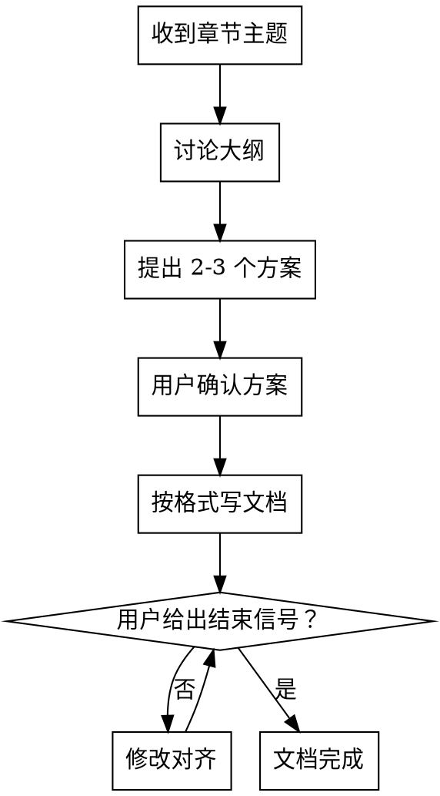

# RTOS 章节文档编写（本项目专用）

## 项目背景

本 skill 专用于 `rust_qemu` RTOS 项目。文章放在 `docs/chapters/NN-章节名/NN-小节名.md`，格式规范见 `docs/内容编写指南.md`，图片放在 `docs/diagrams/`。

## 读者画像与写作风格

**读者画像：** 新手小白，有基础 Rust 语法经验，但对 ARM 硬件、裸机编程、RTOS 概念完全陌生。

**写作要求（每篇文档必须遵守）：**

- **由浅入深**：先讲"是什么、为什么"，再讲"怎么做"，不跳步骤
- **多用类比和比喻**：遇到抽象概念必须给出类比（如"中断就像手机来电打断你正在做的事"）
- **解释每一行代码**：代码块后面必须逐行或逐段解释，不能只贴代码
- **不省略前提**：每个步骤都写清楚"在哪个文件里改"、"在什么位置插入"
- **标注初学者易混淆点**：用 `> **注意：**` 引用块标出常见误区

## 流程

## 第一步：讨论大纲

收到章节主题后，先与用户讨论以下内容，**不要直接开始写**：

1. **本章目标**：读完本章能达到什么状态？（如"能在 QEMU 上运行最小 Rust 裸机程序"）
2. **技术选型**：关键决策点，如：
   - 使用哪个 QEMU machine（mps3-an547 / mps3-an536 / virt 等）
   - 链接脚本策略（手写 / cortex-m-rt / 自定义）
   - 是否涉及汇编入口
3. **覆盖深度**：本章只讲配置和运行，还是要深入解释内存布局、启动序列等原理？
4. **边界**：本章不讲什么（防止范围蔓延）

## 第二步：提出 2-3 个方案

根据讨论结果，提出 2-3 个不同的文章结构方案，每个方案给出：
- 章节 H2 列表（大纲骨架）
- 侧重点差异（深度 vs 广度 / 原理 vs 操作 / 简洁 vs 详细）

等用户选择或指定合并方式后再进入第三步。

## 第三步：按格式写文档

严格按照 `docs/内容编写指南.md` 的格式要求写文档：

**必须包含的结构（frontmatter 之后直接从 `#` 标题开始，不写重复的文章总标题）：**
- frontmatter（title / description / difficulty / estimatedTime / keywords）
- `# 本章目标`（简洁，2-3 条）
- `# 前置知识`（**核心，详细展开**：概念、工具版本、前序章节；子节用 `##`）
- `# 背景与设计决策`（简洁，1-3 段，子节用 `##`）
- `# 实现步骤`（**核心，详细展开**，用 `## 步骤N：` 细分）
- `# 验证方法`（简洁，给出可直接运行的完整命令 + 预期输出）
- `# 练习题`（3-5 道，覆盖本章核心概念）

**代码块语言标注：**
- Rust → `rust`
- 汇编 → `asm`
- Shell 命令 → `bash`
- TOML 配置 → `toml`
- 链接脚本 → `text`

**加粗约定：** 使用 `**bold**`，不使用 `__bold__`。

## 第四步：等待结束信号

文档输出完成后，等待用户操作：
- 用户提出修改意见 → 修改后继续等待
- 用户说"完成" / "确认" / "好了" 等明确信号 → 文档完成
- **不主动宣布文档完成**，必须等用户确认

## 文件存放

文章路径：占位文件已在 `docs/chapters/` 下创建好，直接覆盖对应文件
图片路径：`docs/diagrams/文件名.svg`
